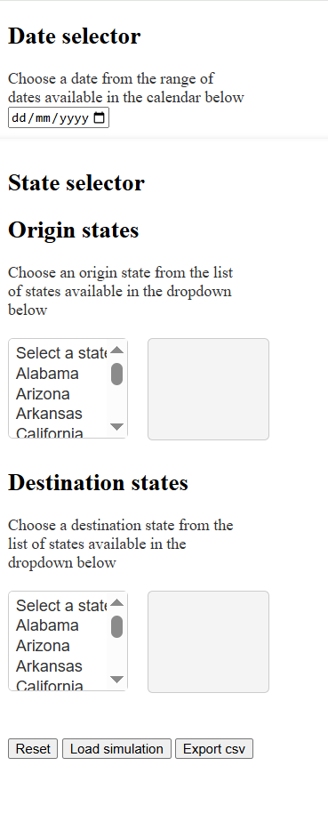

# Visualisation des flux de population aux États-Unis

Cette application web interactive dévellopé dans le cadre du cours visualisation de données dispensé par Isaac Pante (SLI, Lettres, UNIL)).
 permet de visualiser les flux de population entre les États américains. Elle propose une carte dynamique, des sélecteurs de dates et d'États, ainsi que des outils pour filtrer, analyser et exporter les données.

 

## 🌍 Fonctionnalités

- 📅 **Sélecteur de date** pour filtrer les données par jour
- 🧭 **Sélecteurs d’États** d’origine et de destination
- 🔄 **Boutons** pour réinitialiser ou simuler les flux
- 📤 **Export CSV** des données affichées

   

- 🗺️ **Carte interactive** des États-Unis continentaux
- 🧠 **Info-bulle** au survol des éléments
- ℹ️ **Fenêtre d'information** au survol de l’icône Information en haut a droite
     


## 🧪 Technologies utilisées

- HTML / CSS / JavaScript
- [D3.js](https://d3js.org/) pour les visualisations
- [TopoJSON](https://github.com/topojson/topojson) pour les données géographiques
- [json2csv](https://github.com/zemirco/json2csv) pour l’exportation

## 📦 Sources de données

- **Géométrie de la carte** : [us-atlas (TopoJSON)](https://github.com/topojson/us-atlas)
- **Flux de population** : [GeoDS - COVID19USFlows](https://github.com/GeoDS/COVID19USFlows)

> ⚠️ **Remarque** : Cette visualisation est à but exploratoire. Les flux de population affichés ne permettent pas de distinguer les types de déplacements (migration, tourisme, travail, etc.). Le périmètre géographique (États-Unis continentaux) a été choisi pour des raisons pratiques, sans intention politique.

## 🚀 Guide d'utilisation

### Cloner le dépôt

```bash
git clone https://github.com/madjidsadou/ip_vis_finale
cd ip_vis_finale
```

### Ouvrir index.html
### Choisir une date, une ou plus plusieur states d'origines et de destinations.
attention: pour choisir plusieurs states en tant qu'origine ou destionation, il faut maintenir la touche "Ctrl" sur le clavier tout en cliquant sur les states
### Clicker sur le boutton simulate.
### exportation de données.
### utiliser la barre de recherche avec IA a la place du choix manuel.

## 🚀 Vidéo Quick start


